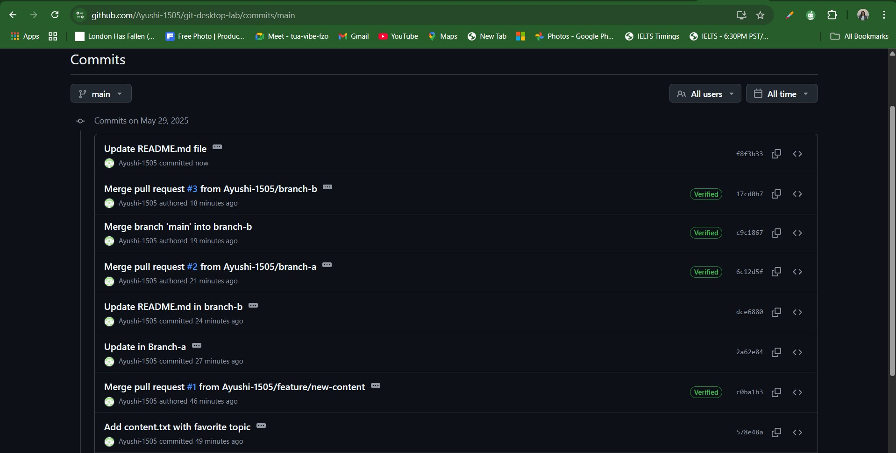

## GitHub Desktop Lab

# git-desktop-lab
- This is Lab 4 - Git & GitHub with github desktop

- This lab demonstrates GitHub Desktop usage for version control and conflict resolution.

- This lab will fruther introduce concepts of GitHub,  where i will commit, push my code from local repository to remote repository (GitHub). Moreover, i will pull some new changes from GitHub, creating new branch & merge conflicts and resolving them into main branch.

# This is branch A and this is branch B. (conflict resolved)

# GitHub Desktop Lab

### 1. Repository Setup
- Created a new repository named `git-desktop-lab` on GitHub.
- Initialized the repo with a README file.
- Cloned it to my local machine using GitHub Desktop.

### 2. Basic Git Operations
- Added a new file called `info.txt` with my name, student ID, and course.
- Updated the README to describe the lab purpose.
- Committed and pushed both changes to GitHub.

### 3. Branching and Merging
- Created a new branch `feature/new-content`.
- Added a file `content.txt`.
- Committed and pushed the branch.
- Created a pull request and merged it into `main`.
- Pulled the changes to my local `main` branch.

### 4. Merge Conflict Resolution
- Created two new branches: `branch-a` and `branch-b`.
- Edited the same line in `README.md` differently in each branch.
- Merged `branch-a` into `main`.
- Switched to `branch-b` and pulled changes from `main`, which caused a conflict.
- Used GitHub Desktop to resolve the merge conflict.
- Committed the fix, pushed the branch, and merged it into `main`.

## Challenges Encountered

- Initially had trouble identifying conflicting lines in `README.md`.
- GitHub Desktop made conflict resolution easier through a visual interface.
- Learned the importance of committing frequently and writing clear commit messages.

## Merge Conflict Resolution Screenshot

